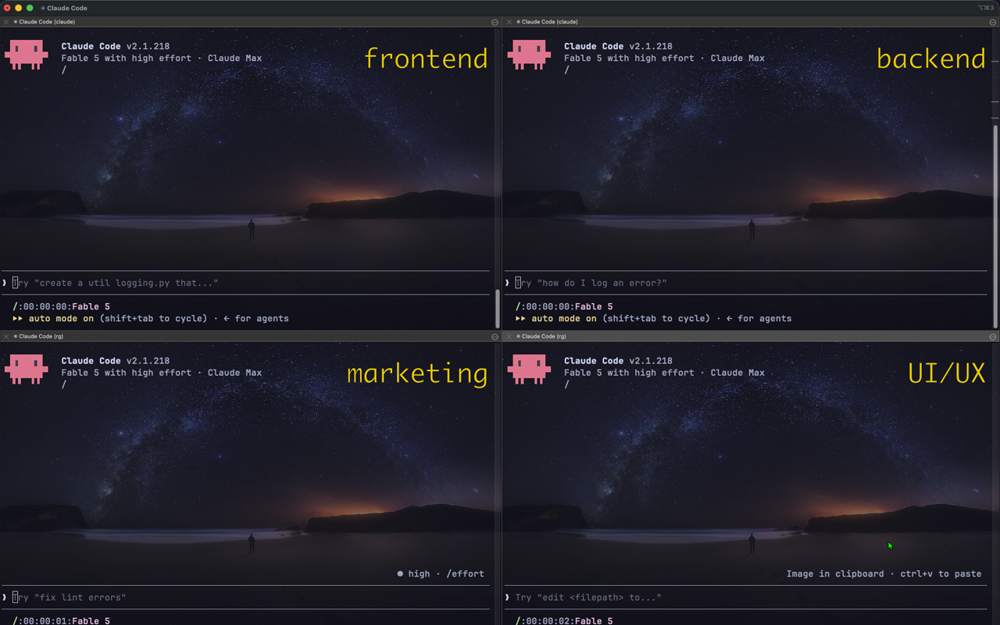
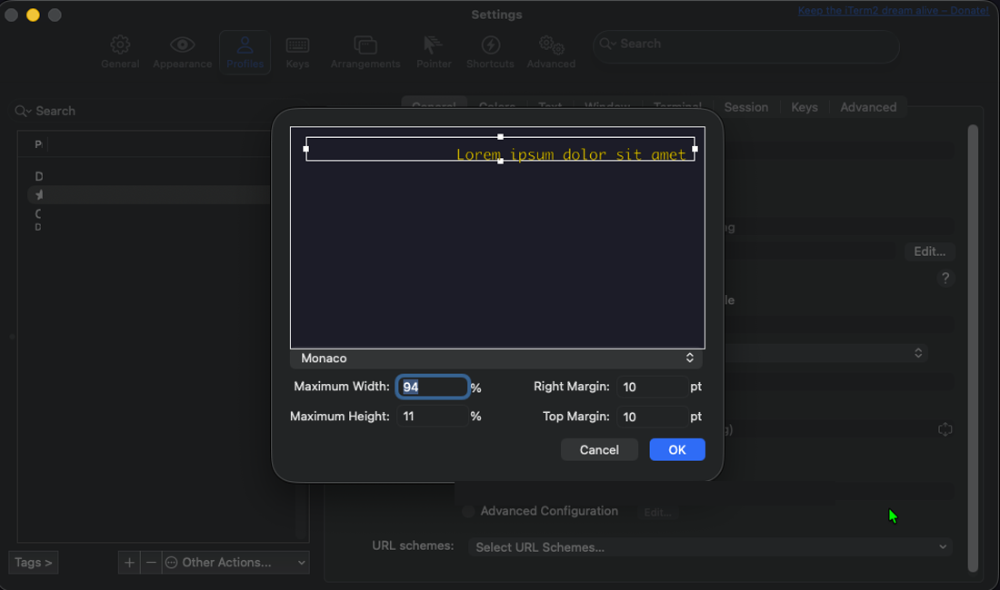

# iterm-badge 
# Claude Marketplace Plugin / Skill

A tiny [Claude Code](https://code.claude.com/docs/en/overview) plugin that sets and clears the **iTerm2 window badge** — the big translucent label iTerm2 draws in the top-right corner of the terminal. Label each Claude Code session with its project name and you can tell your windows apart at a glance, even from across the room or in Mission Control.



It exposes two slash commands:

| Command | What it does |
| :-- | :-- |
| `/iterm-badge:itb <text>` | Set the badge to `<text>` (emoji welcome) |
| `/iterm-badge:itc` | Clear the badge |

## Install

The `/plugin` commands below are **slash commands typed inside a Claude Code session**, not shell commands — no need to clone this repo first.

1. Open a terminal (iTerm2, since that's the point 🙂) and start Claude Code:

   ```bash
   claude
   ```

2. At the Claude Code prompt, add this repo as a plugin marketplace (Claude Code fetches it from GitHub for you):

   ```
   /plugin marketplace add i18nllc/iterm-badge
   ```

3. Install the plugin from it:

   ```
   /plugin install iterm-badge@iterm-badge
   ```

4. Try it:

   ```
   /iterm-badge:itb Hello
   ```

   A translucent "Hello" appears in the window's top-right. If the commands aren't found, restart Claude Code (or run `/reload-plugins`) and try again.

### Local development

Clone the repo and launch Claude Code with the plugin loaded directly:

```bash
git clone https://github.com/i18nllc/iterm-badge.git
cd iterm-badge
claude --plugin-dir .
```

### Prefer short `/itb` / `/itc` names?

Plugin commands are always namespaced (`/iterm-badge:itb`). If you'd rather type the short names, skip the plugin and copy the two command files into your user commands directory instead:

```bash
cp commands/itb.md commands/itc.md ~/.claude/commands/
```

They then load as `/itb` and `/itc` in every project.

## Usage

```
/iterm-badge:itb HeyTrainer 🏋️
/iterm-badge:itc
```

**One badge per window.** The badge belongs to the iTerm2 session (window/tab/pane), so the pattern for juggling multiple projects is: open one window per project, and in each one run `/iterm-badge:itb <project name>` as your first command. Every window now wears its project's name — no more "which Claude is this?" when you Cmd-Tab back.

## Let Claude drive the badge

Setting the badge yourself is nice; having **Claude keep it updated while it works** is the killer feature. The slash commands are deliberately manual (`disable-model-invocation: true` — Claude never renames your window uninvited), but the same escape sequence is one shell script away, and Claude can run *that* on request.

### One-time setup: the badge helper script

Save this as `~/.claude/badge.sh` (and `chmod +x` it). It walks up the process tree to find the session's real tty, so it works from Claude's Bash tool and from hooks, where there is no controlling terminal:

```sh
#!/bin/sh
# Set the iTerm2 badge ($* = text, empty = clear).
b64=$(printf '%s' "$*" | base64)
if [ -n "$TMUX" ]; then
  printf '\ePtmux;\e\e]1337;SetBadgeFormat=%s\a\e\\' "$b64" > "$(tmux display-message -p '#{pane_tty}')"
  exit 0
fi
p=$PPID
while [ -n "$p" ] && [ "$p" -gt 1 ]; do
  t=$(ps -o tty= -p "$p" | tr -d ' ')
  if [ -n "$t" ] && [ "$t" != "??" ]; then
    printf '\e]1337;SetBadgeFormat=%s\a' "$b64" > "/dev/$t"
    exit 0
  fi
  p=$(ps -o ppid= -p "$p" | tr -d ' ')
done
echo "no tty found"  # headless run — harmless no-op
```

Then pick your flavor:

## 1. Claude narrates its work

Add one line to a project's `CLAUDE.md`:

> When you start a multi-step task, run `sh ~/.claude/badge.sh <2-3 word summary>` (e.g. `🔧 fixing auth`) and update it as the work progresses.

Each window now tells you what its Claude is *doing* — `🔧 fixing auth`, `3/7 tests`, `deploying…` — readable from across the room or in Mission Control.

## 2. An "is Claude done?" lamp, via hooks

Wire the script into [hooks](https://code.claude.com/docs/en/hooks) in `~/.claude/settings.json` and the badge becomes an ambient status light — glance at any window to know whether Claude is grinding, finished, or waiting on you:

```json
{
  "hooks": {
    "UserPromptSubmit": [{ "hooks": [{ "type": "command", "command": "sh ~/.claude/badge.sh 🔄 working" }] }],
    "Stop": [{ "hooks": [{ "type": "command", "command": "sh ~/.claude/badge.sh ✅ done" }] }],
    "Notification": [{ "hooks": [{ "type": "command", "command": "sh ~/.claude/badge.sh ⏳ needs you" }] }]
  }
}
```

## 3. A "review me" flag

Juggling several projects? Tell Claude: *"when you finish and want my review, badge this window 👀 review me"* — the window that's blocked on you announces itself.

## Requirements

- **iTerm2** — badges are an iTerm2-only feature ([OSC 1337 `SetBadgeFormat`](https://iterm2.com/documentation-badges.html)). On any other terminal the commands print a message and no-op; nothing breaks.
- **tmux ≥ 3.3** (only if you run Claude Code inside tmux): the escape sequence is sent through tmux's DCS passthrough, which is off by default since 3.3. Add to `~/.tmux.conf`:

  ```
  set -g allow-passthrough on
  ```

## Limitations

- **iTerm2 only.** The badge escape sequence (OSC 1337 `SetBadgeFormat`) is an iTerm2 extension. Other terminals (Terminal.app, Ghostty, Alacritty, …) simply ignore the sequence, and when no tty is reachable at all (headless runs) the commands print a note and exit cleanly — nothing breaks either way.
- **tmux works, but is opt-in.** Unlike naive badge scripts, the commands do wrap the sequence in tmux's DCS passthrough — but tmux ≥ 3.3 ships with passthrough disabled, so without `set -g allow-passthrough on` (see [Requirements](#requirements)) the badge silently won't appear.
- **Text only, one badge per session.** The badge is plain text (plus emoji and iTerm2 interpolated variables) — no inline colors or markup, and setting a new badge replaces the old one. Styling lives in the iTerm2 profile, not the command (see [Styling the badge](#styling-the-badge)).
- **Not persistent.** The badge belongs to the live iTerm2 session; close the window and it's gone. Re-run `/iterm-badge:itb` in new sessions (or bake a default into the profile's badge field).
- **Namespaced names.** Plugin commands are always `/iterm-badge:itb` / `/iterm-badge:itc` — typing `/itb` fuzzy-matches in the command picker, or copy the files to `~/.claude/commands/` for true short names (see [Install](#prefer-short-itb--itc-names)).

## Styling the badge

The escape sequence sets the badge **text only**. Appearance — color, font, size, position — is configured per-profile in iTerm2:



1. iTerm2 menu → **Settings** (Cmd+,) → **Profiles** → select your profile → **General** tab → **Badge** section.
2. The **color well** next to the badge field sets the badge color **and alpha** — lower the alpha for the classic translucent watermark look.
3. The **Edit** (gear) button opens the rest: font family, bold/italic, **Max Width %** / **Max Height %** (the badge auto-scales down to fit within these), and top/right margins.

Notes:

- Styling is **per-profile**: all windows using one profile share it. For per-project badge colors, create one profile per project.
- Badge text supports **emoji** and iTerm2 [interpolated variables](https://iterm2.com/documentation-badges.html) like `\(session.hostname)` — but no inline markup (no per-word colors or fonts).

## How it works (the fiddly parts)

Claude Code runs slash-command inline bash with **no controlling terminal**, so the obvious `> /dev/tty` fails with "device not configured". The commands instead:

- outside tmux: resolve the real device via `ps -o tty= -p $PPID` and write to `/dev/<tty>`;
- inside tmux: write to `tmux display-message -p '#{pane_tty}'`, wrapping the sequence in tmux's `\ePtmux;` DCS passthrough (inner escapes doubled) so it reaches iTerm2 intact;
- badge text is base64-encoded per iTerm2's OSC 1337 `SetBadgeFormat` protocol;
- if no tty can be found (e.g. headless runs), they print a message and exit 0.

## License

[MIT](LICENSE) © 2026 Lou / i18nllc
